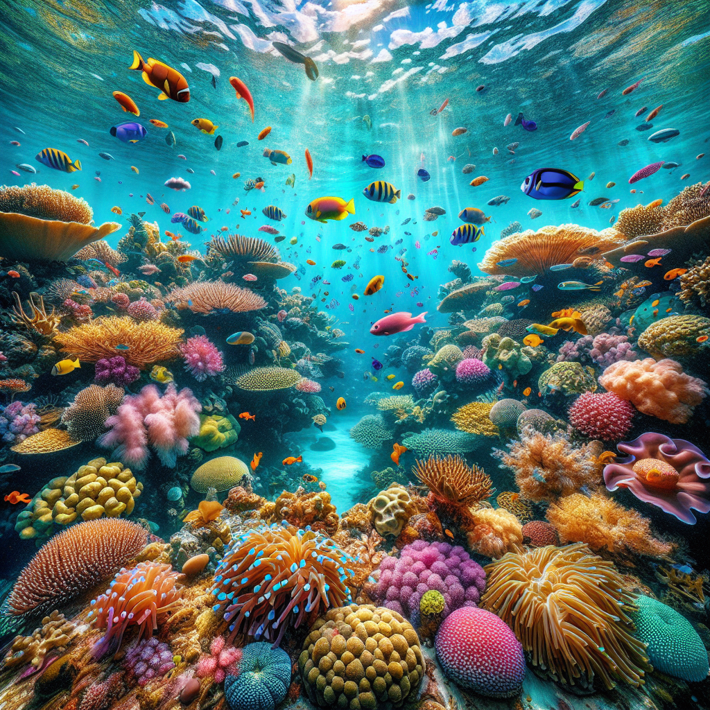
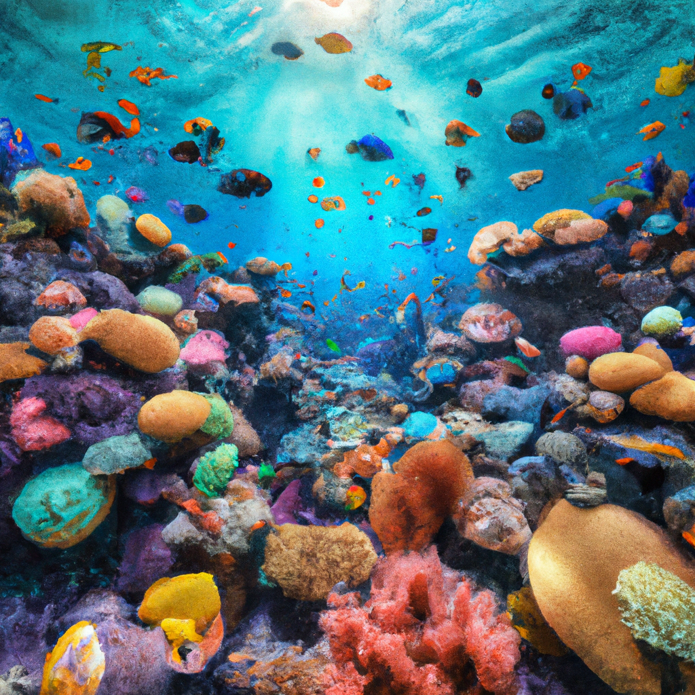

# DALLEAgent 🖼️✨

**DALLEAgent** is a Python wrapper around the OpenAI DALL-E image generation models (both DALL-E 2 and DALL-E 3), allowing you to easily generate images, create variations, and fine-tune image generation parameters such as resolution, quality, and style. This library leverages the power of DALL-E for creative tasks like artwork generation, prototyping, or just having fun with AI-generated visuals

## Features
- **Support for DALL-E 2 and DALL-E 3**: Easily switch between different DALL-E models.
- **Image generation**: Create images from text prompts.
- **Image variation**: Generate variations of an existing image.
- **Flexible configuration**: Customize image resolution, quality, style, and more via simple enums.
- **Multiple return modes**: Return results as image URLs or as PIL.Image objects.
- **Error handling**: Built-in validation and error reporting for inputs and API responses.

## Usage
### Initializing DALLEAgent
You can instantiate the DALLEAgent by providing your OpenAI API key as either a string or a file path:

```
from DALLEAgent import DALLEAgent

# Initialize the agent with your OpenAI API key

dalle = DALLEAgent(key="key")
```

### Generate Images from a Prompt

You can generate an image from a text prompt, specifying the model, resolution, quality, and return mode (either URLs or images).

```
# Generate a single 1024x1024 image with standard quality
images = dalle.generate_from_prompt(
    prompt="A beautiful coral reef",
    model=DALLEAgent.MODELS.DALLE3,
    size=DALLEAgent.RESOLUTIONS.LARGE,
    quality=DALLEAgent.QUALITIES.STANDARD,
    return_mode=DALLEAgent.RETURN_MODE.IMAGE
)

# Display the image using PIL
images[0].show()
```

Output:



The ```generate_from_prompt``` accepts the following parameters:

- **prompt:** The string of text to condition the generation.
- **model:** Either ```DALLEAgent.MODELS``` values or a string containing the model name. The string must be either 'dalle-e-2' or 'dall-e-3'.
- **n:** Integer to set how many images to generate. Can go from 1 to ten for dalle2, must be set to 1 for dalle 3.
- **quality:** Either 'hd' or 'standard' or one of the equivalent ```DALLEAgent.QUALITIES``` values. Notice that the HD quality it-s supported only by dalle 3.
- **size:** The desired size for the generated images expressed as a string, it can be set to '25sx256' (tiny), '512x512' (small) '1024x1024' (large), '1792x1024' (wide), '1024x1792' (tall) or one of the equivalent ```DALLEAgent.RESOLUTIONS``` values. Notice that dalle 2 only supports tiny, small and large, while dalle 3 only supports large, wide and tall.
- **style:** Only available for dalle 3 and can be used to set the style of the image to either be natural or more dramatic and high contrast. Passed as a string that must be either 'vivid' or 'natural' or one of the equivalent ```DALLEAgent.STYLES``` values.
- **return_mode:** If to return the URL to the images or the PIL images themselves. Passed either as 'url' or 'image' or one of the equivalent ```DALLEAgent.RETURN_MODE``` values.

### Generate Image Variations
You can also create variations of an existing image by providing a path to a PNG file.

```
# Generate variations of an existing image
variations = dalle.image_variation(
    image="readme_images/coralreef.png",
    n=1,  # Generate 3 variations
    size=DALLEAgent.RESOLUTIONS.LARGE
)

# Print URLs of the generated variations
variations[0].show()
```

Output:



The ```image_variation``` accepts the following parameters:

- **image:** The input image either as a Path object or a string. The image must be in PNG format, be less than 4MB and must be a square image.
- **n**
- **size**
- **return_mode**

## Requirements

**openai** == 1.52.1

**pillow** >= 10.4.0