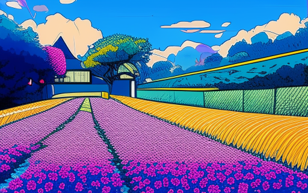

# KandinskyWrapper

KandinskyWrapper is a wrapper built around the [HuggingFace's Kandinsky Img2Img pipeline](https://huggingface.co/docs/diffusers/using-diffusers/kandinsky). It can be used to generate images starting from a reference image and a prompt.

## How use it

Initialize the pipeline with

```pipeline = KandinskyWrapper()```

Initializing it this way will download the model's weights from the HuggngFace hub, once done the model will save all the needed files under ```kandinsky_checkpoints```.

If these files were already downloaded and saved in a directory specify its path when initializing the pipeline such as

```pipeline = KandinskyWrapper(path_to_weights)```

Once everything is set up you can start generating images by simply calling the pipeline with the desired prompt and the reference image

```images = pipeline(your_prompt, your_image)```

This function accepts as parameters

- **prompt** (str | list[str]): The prompt(s) to follow when generating, the pipeline will generate one image per prompt if a list of prompts is provided. The model has already a prompt to influence the style of the generation to obtain anime style images (as per request), the provided prompts will simply be attached to the base prompt. To access/edit it simply call ```pipeline.base_prompt```.
- **image** (str | Path | PIL.Image): The reference image. Must be a valid path or a PIL image object.
- **negative_prompt** (str | list[str], optional): What the model **must not** generate. If only one is provided, it will be applied to every image while if a list is provided it must be of the same length as the provided prompts. As for the prompt parameter, the model has a base negative prompt from the get go and your negative prompts will be attached to it. If you want to access/edit this property simply call ```pipeline.base_negative_prompt```.
- **num_inference_steps** (int, optional): Number of denoising steps performed by the model. Defaults to 100.
- **strength** (float, optional): Value between 0 and 1 that describes how much the model follows the reference image. 0 will leave the original image unchanged, 1 will ignore it completely. Defaults to 0.7.
- **guidance_scale** (float, optional): How much the model should follow the given prompt. If 0 the model will ignore it completely. Defaults to 6.0.
- **seed** (int, optional): The seed for the generator to obtain deterministic result. If none is provided the model will sample one at random.

Calling the pipeline returns a dictionary with the following fields:
- **seed**: The seed used to generate the images
- **images**: A list of dictionaries (one per prompt) containing:
    - **image**: The generated image as a PIL.Image object.
    - **prompt**: Prompt used to generate it,
    - **negative_prompt**: Negative prompt used to generate it.

## Examples

Starting from this image:


Initialize the pipeline

```pipeline = KandinskyWrapper('/content/kandinsky_checkpoints') # I had already downloaded the weights```

Generate the image with the new style with an empty prompt and check the output:

```
output = pipeline('', 'reference_img.png')
output['images'][0]['image']
```



The model generated an image that doesn't resemble the original one, even though the style is good. To solve this problem we can try to lower the **strength** parameter to 0.3:

```
output = pipeline('', 'reference_img.png', strength=0.3)
output['images'][0]['image']
```


The default parameters where set to these values because they tend to **generally** (and i cannot stress this enough) are optimal for images with persons but they don't always work perfectly. More than one generation culd be needed to produce an acceptable result and some paremeter tuning might be needed to find wha works best for you.

## Requirements

diffusers == 0.31.0

Pillow == 11.0.0

torch == 2.5.1+cu121